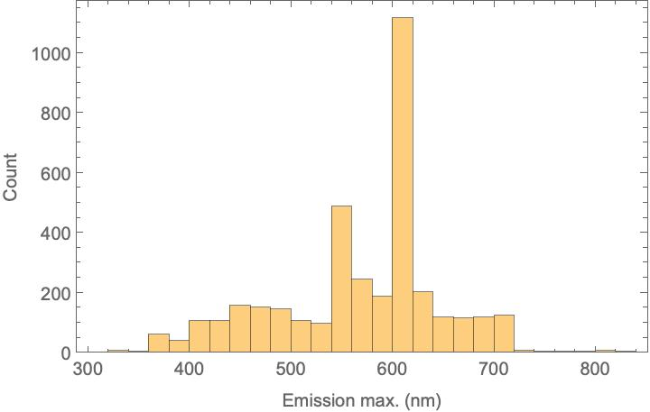
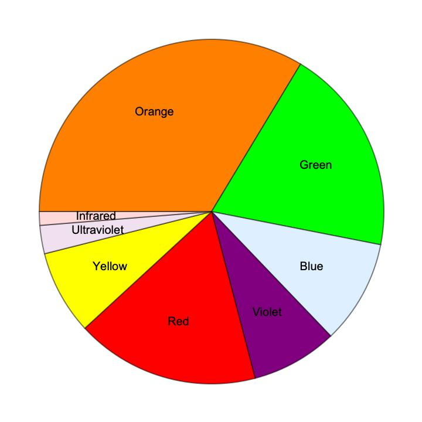
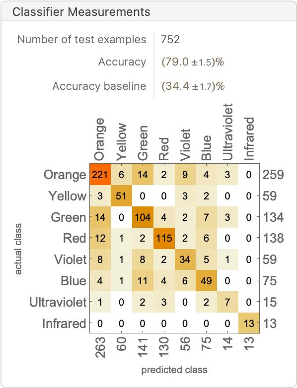
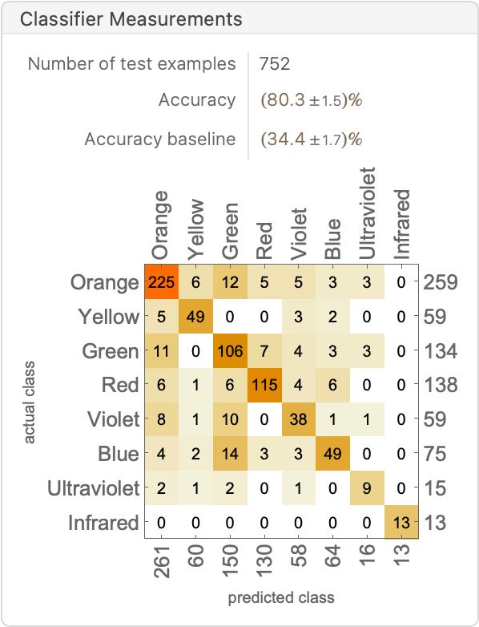
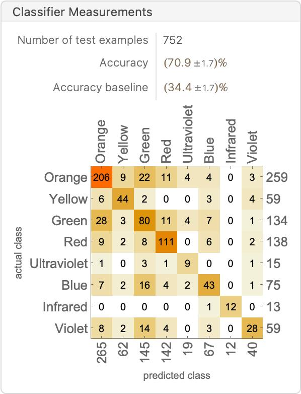
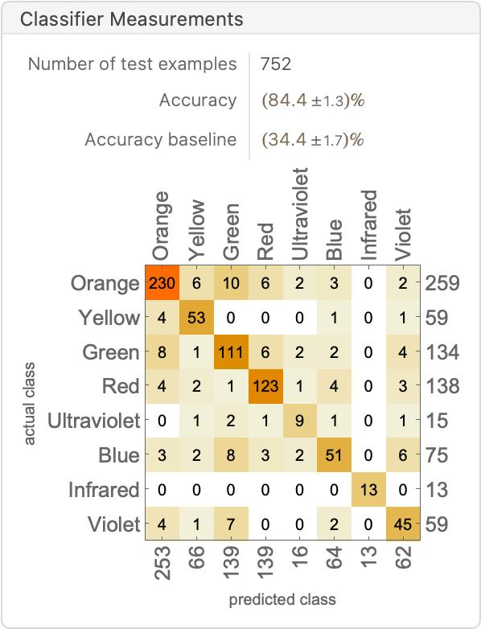
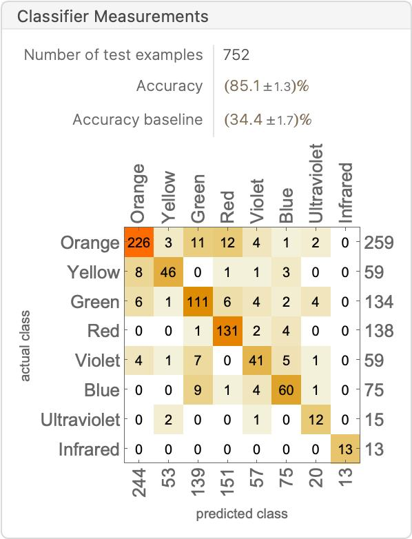
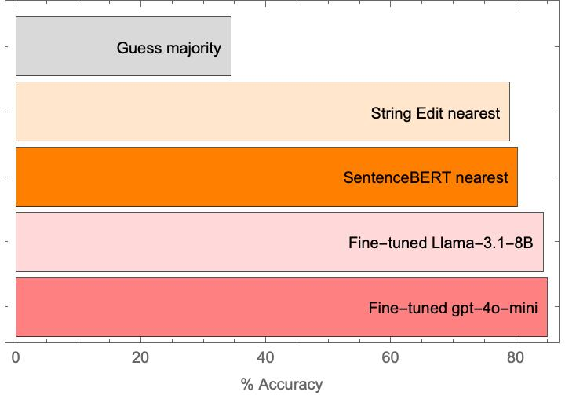

# Introduction

This is a project for the [2024 KRICT ChemDX Hackathon](https://gitlab.chemdx.org/global-network/2024-krict-chemdx-hackathon/-/wikis/home)
This project uses the [KRICT Inorganic Phosphor Optical Property](https://litdx.materials.chemdx.org) dataset.  The goal is to try to predict the color that the phosphor emits, given only the chemical formula describing the phosphor: e.g., `Ba2La6.4Si6O26Eu1.6 -> Orange`.  

Motivated by my recent work on [solid-state chemistry predictions using fine-tuned LLMs](https://doi.org/10.1021/jacs.4c05840) and [text embedding vectors](https://dx.doi.org/10.26434/chemrxiv-2024-ltncz), which I spoke about earlier in the week at the [KRICT R&D Forum: Materials, AI, and Autonomous Laboratory](https://gitlab.chemdx.org/global-network/krict-forum-2024), I will try to see how much can be learned directly from the formula strings. We will compare 4 different methods:
- [String Edit ('Levenshtein') Distance](https://en.wikipedia.org/wiki/Levenshtein_distance)
- [SentenceBERT semantic similarity](https://arxiv.org/abs/1908.10084)
- Fine-tuned [Llama](https://www.llama.com)-3.1-8B LLM
- Fine-tuned [gpt-4o-mini](https://platform.openai.com/docs/models/gpt-4o-mini) LLM

# Data Overview

The data was provided as an XLSX file (`data/Inorganic_Phosphor_Optical.xlsx`), where the maximum emission wavelength is provided in nanometers.

The script `scripts/01_Data_preparation.wls` converts this to the corresponding color, and performs a random 80/20% train/test split of the data. (There are 3008 training items and 752 test items.)  It also does some visualization of the dataset, which we show below:

# Modeling Methods & Results

For reference, the most common class is "Orange" emission, and if you select this majority class all the time, you will be correct ~34% of the time.

## String Edit Distance

Relevant code is in `scripts/05_Edit_Distance.wls`.  In short, we compute the [Levenshtein edit distance](https://reference.wolfram.com/language/ref/EditDistance.html) between the a query chemical formula and the examples in the training set, and select the nearest one.  The premise here is that similar formulas should have similar results. This gives surprisingly high accuracy of 79%.

## SentenceBERT vector similarity

Next, we examined encoding the chemical formulas using [SentenceBERT](https://arxiv.org/abs/1908.10084). Naively, we don't expect this to be amazing, as SentenceBERT is really more about semantic meaning of general text, but it is easy enough to do. Implementation is in `scripts/02_SentenceBert_Similarity.wls`

Using the nearest similarity example yields the best results (comparable, maybe slightly better than string edit distance):

We can also look at the commonest label for the 10 nearest items, and this is noticeably worse:

**Possible improvements:**
- Use a different/better similarity function
- Tune the number of nearest-neighbors to consider

## Fine-tuned LLM models (Lllama 3.1-8B and GPT-40-mini) 

What about fine-tuning LLMs on this?  We use the system prompt: `You are an expert materials chemist predicting the emission color of a phosphor with the chemical composition provided.  Answer only with the following color names and no other output: Ultraviolet, Violet, Blue, Green, Yellow, Orange, Red, Infrared.`

The chemical formula is provided as the user content and the color is the agent response.  We fine-tuned this on [Openpipe](https://openpipe.ai) using default hyperparameters, then downloaded the evaluated results (`results/KRICT_Phosphors_(test_entries).jsonl`) and analyze them with `scripts/04_Evaluate_Openpipe_results.wls`. (Elsewhere I have written more extensive [notes on LLM fine-tuning](https://jschrier.github.io/blog/2024/06/29/LLM-Finetuning-Notes.html) which may be useful if you are new to this field.)

The two fine-tuned LLMs are comparable (84-85% accuracy), which is a noticeable improvement upon using the edit distance/string similarity. Not bad for a chatbot! 

Fine-tuning Llama-3.1 model cost $2.48 USD;  I've put the LoRA BF16 weights in `models`.

Fine-tuning gpt-4o-mini model cost $2.22 USD.  You'll have to make your own, if you want to reproduce this, but you can do it easily using the `data/train.jsonl` file.

### Llama-3.1-8b

### GPT-4o-mini

**Possible improvements:**
- Play with fine-tuning hyperparameters and prompt
- Perform a cross-validation to assess error bars
- Examine the log-probabilities of output, evaluate perplexity, etc.

# Conclusions and Future Directions

It is possible to predict natural language color of the emission of a phosphor given its chemical formula with reasonable accuracy using these text-based approaches. Additionally, adopting a text based approach may be more natural for scientific users.

